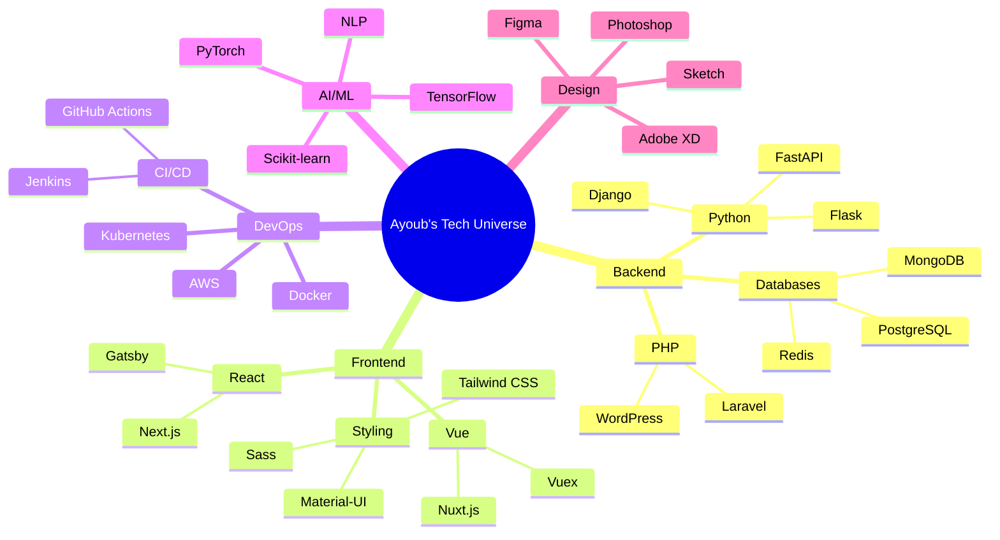
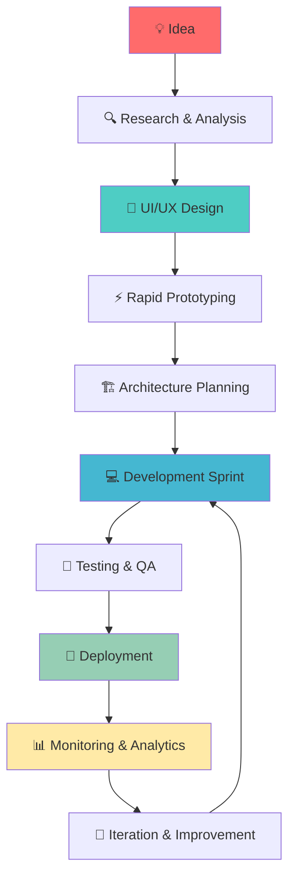

# 🌟 Ayoub Mharrech | Digital Architect & Innovation Catalyst

<div align="center">
  
</div>

```ascii
    ╔══════════════════════════════════════════════════════════════════════════╗
    ║                                                                          ║
    ║      ▄▄▄▄▄▄▄▄▄▄▄  ▄         ▄  ▄▄▄▄▄▄▄▄▄▄▄  ▄         ▄  ▄▄▄▄▄▄▄▄▄▄      ║
    ║     ▐░░░░░░░░░░░▌▐░▌       ▐░▌▐░░░░░░░░░░░▌▐░▌       ▐░▌▐░░░░░░░░░░▌     ║
    ║     ▐░█▀▀▀▀▀▀▀█░▌▐░▌       ▐░▌▐░█▀▀▀▀▀▀▀█░▌▐░▌       ▐░▌▐░█▀▀▀▀▀▀▀█░▌    ║
    ║     ▐░▌       ▐░▌▐░▌       ▐░▌▐░▌       ▐░▌▐░▌       ▐░▌▐░▌       ▐░▌    ║
    ║     ▐░█▄▄▄▄▄▄▄█░▌▐░█▄▄▄▄▄▄▄█░▌▐░▌       ▐░▌▐░▌       ▐░▌▐░█▄▄▄▄▄▄▄█░▌    ║
    ║     ▐░░░░░░░░░░░▌▐░░░░░░░░░░░▌▐░▌       ▐░▌▐░▌       ▐░▌▐░░░░░░░░░░▌     ║
    ║     ▐░█▀▀▀▀▀▀▀█░▌ ▀▀▀▀█░█▀▀▀▀ ▐░▌       ▐░▌▐░▌       ▐░▌▐░█▀▀▀▀▀▀▀█░▌    ║
    ║     ▐░▌       ▐░▌     ▐░▌     ▐░▌       ▐░▌▐░▌       ▐░▌▐░▌       ▐░▌    ║
    ║     ▐░▌       ▐░▌     ▐░▌     ▐░█▄▄▄▄▄▄▄█░▌▐░█▄▄▄▄▄▄▄█░▌▐░█▄▄▄▄▄▄▄█░▌    ║
    ║     ▐░▌       ▐░▌     ▐░▌     ▐░░░░░░░░░░░▌▐░░░░░░░░░░░▌▐░░░░░░░░░░▌     ║
    ║      ▀         ▀       ▀       ▀▀▀▀▀▀▀▀▀▀▀  ▀▀▀▀▀▀▀▀▀▀▀  ▀▀▀▀▀▀▀▀▀▀      ║
    ║                                                                          ║
    ║              🚀 Full-Stack Developer & UI/UX Designer                    ║
    ║                  🇲🇦 Morocco | 4+ Years Experience                        ║
    ╚══════════════════════════════════════════════════════════════════════════╝
```

<div align="center">
  
</div>

---

## 🎯 Professional Summary

<div align="center">
  
> **"Engineering scalable solutions that bridge the gap between innovative technology and exceptional user experience"**

</div>

**Passionate Full-Stack Developer** with 4+ years of expertise in building robust, scalable applications. I specialize in Python backends, React frontends, and creating seamless user experiences. My journey spans from crafting pixel-perfect interfaces to architecting cloud-native solutions that serve millions of users.

**🔥 Key Strengths:**
- **Backend Excellence**: Django, FastAPI, Laravel - Building APIs that scale
- **Frontend Mastery**: React, Next.js, Vue.js - Creating interfaces users love  
- **UI/UX Innovation**: Figma, Adobe XD - Designing experiences that convert
- **Cloud Architecture**: AWS, Docker, Kubernetes - Deploying with confidence
- **AI Integration**: TensorFlow, PyTorch - Adding intelligence to applications

---

## 🚀 Technology Stack & Expertise

<div align="center">

### 🔥 Proficiency Levels
```
Backend Development  ████████████████████████████████ 95%
Frontend Development ████████████████████████████████ 92%
UI/UX Design        ████████████████████████████████ 88%
DevOps & Cloud      ████████████████████████████████ 85%
AI/ML Integration   ████████████████████████████████ 80%
Mobile Development  ████████████████████████████████ 75%
```

</div>

<table align="center">
<tr>
<td valign="top" width="33%">

### 🐍 Backend Powerhouse
```python
# Python Ecosystem
backend_arsenal = {
    'Django': {
        'level': 'Expert',
        'projects': 50+,
        'specialty': 'Enterprise APIs'
    },
    'FastAPI': {
        'level': 'Advanced',
        'projects': 30+,
        'specialty': 'High-Performance APIs'
    },
    'Flask': {
        'level': 'Expert',
        'projects': 25+,
        'specialty': 'Microservices'
    }
}

# PHP Universe
php_mastery = {
    'Laravel': 'MVC Architecture',
    'WordPress': 'Custom Solutions',
    'CodeIgniter': 'Rapid Development'
}
```

**🔧 Core Technologies:**
- **Languages**: Python, PHP, JavaScript, TypeScript
- **Frameworks**: Django, FastAPI, Laravel, Express.js
- **Databases**: PostgreSQL, MySQL, MongoDB, Redis
- **Testing**: PyTest, PHPUnit, Jest

</td>
<td valign="top" width="33%">

### ⚛️ Frontend Excellence
```javascript
// React Ecosystem
const frontend_stack = {
  React: {
    version: '18.x',
    expertise: 'Hooks, Context, Performance',
    projects: 60+
  },
  NextJS: {
    version: '14.x',
    expertise: 'SSR, SSG, API Routes',
    projects: 35+
  },
  Vue: {
    version: '3.x',
    expertise: 'Composition API, Vuex',
    projects: 20+
  }
};

// Styling Arsenal
const styling_tools = {
  TailwindCSS: 'Utility-First CSS',
  Sass: 'Advanced Styling',
  StyledComponents: 'CSS-in-JS',
  MaterialUI: 'Component Library'
};
```

**🎨 Design & Animation:**
- **Frameworks**: React, Vue.js, Next.js, Nuxt.js
- **Styling**: Tailwind CSS, Sass, Material-UI, Chakra UI
- **Animation**: Framer Motion, GSAP, Lottie
- **Tools**: Figma, Adobe XD, Sketch, Photoshop

</td>
<td valign="top" width="33%">

### 🛠️ DevOps & Cloud
```yaml
# Infrastructure as Code
infrastructure:
  containerization:
    - Docker: "🐳 Multi-stage builds"
    - Kubernetes: "☸️ Orchestration"
    - Docker Compose: "🔧 Local dev"
  
  cloud_platforms:
    - AWS: "☁️ EC2, RDS, S3, Lambda"
    - GCP: "🌐 Cloud Functions, BigQuery"
    - Azure: "🔷 App Service, CosmosDB"
  
  monitoring:
    - Prometheus: "📊 Metrics"
    - Grafana: "📈 Visualization"
    - ELK Stack: "🔍 Logging"

# AI/ML Stack
ai_expertise:
  frameworks:
    - TensorFlow: "🧠 Deep Learning"
    - PyTorch: "🔥 Research & Production"
    - Scikit-learn: "📊 Classical ML"
  
  specialties:
    - NLP: "📝 Text Processing"
    - Computer Vision: "👁️ Image Analysis"
    - Recommendation Systems: "🎯 Personalization"
```

</td>
</tr>
</table>

---

## 📊 GitHub Analytics & Performance

<div align="center">
  
  
</div>

<div align="center">
  
</div>

<div align="center">
  
</div>

---

## 🏆 Achievement Gallery

<div align="center">
  
</div>

<div align="center">
  <table>
    <tr>
      <td align="center">
        
        <br><sub><b>Consistency Champion</b></sub>
      </td>
      <td align="center">
        
        <br><sub><b>Community Favorite</b></sub>
      </td>
      <td align="center">
        
        <br><sub><b>Project Master</b></sub>
      </td>
      <td align="center">
        
        <br><sub><b>Team Player</b></sub>
      </td>
    </tr>
  </table>
</div>

---

## 🎯 Professional Journey & Milestones

<div align="center">

```mermaid
gantt
    title Professional Development Timeline
    dateFormat  YYYY-MM-DD
    section Learning Phase
    HTML/CSS/JavaScript     :done, basics, 2020-01-01, 2020-06-30
    Python & Django         :done, python, 2020-07-01, 2020-12-31
    section Professional Growth
    React & Frontend        :done, react, 2021-01-01, 2021-06-30
    Full-Stack Projects     :done, fullstack, 2021-07-01, 2021-12-31
    section Specialization
    UI/UX Design           :done, design, 2022-01-01, 2022-06-30
    DevOps & Cloud         :done, devops, 2022-07-01, 2022-12-31
    section Innovation
    AI/ML Integration      :done, ai, 2023-01-01, 2023-06-30
    Advanced Architecture  :done, arch, 2023-07-01, 2023-12-31
    section Current Focus
    Next-Gen Development   :active, nextgen, 2024-01-01, 2024-12-31
    section Future Goals
    Tech Leadership        :future, leadership, 2025-01-01, 2025-12-31
```

</div>

---

## 🌐 Tech Stack Visualization

<div align="center">



</div>

---

## 🔥 Featured Projects Showcase

<div align="center">
  <table>
    <tr>
      <td width="50%">
        <h3 align="center">🚀 E-Commerce Platform</h3>
        <div align="center">
          
          
          
          <br><br>
          <p><b>Full-stack e-commerce solution</b> with real-time inventory, payment processing, and advanced analytics. Handles 10K+ daily transactions.</p>
          <p>🔥 <b>Tech Highlights:</b> Django REST API, React SPA, Stripe Integration, Redis Caching</p>
        </div>
      </td>
      <td width="50%">
        <h3 align="center">🤖 AI-Powered CRM</h3>
        <div align="center">
          
          
          
          <br><br>
          <p><b>Intelligent CRM system</b> with ML-powered lead scoring, automated workflows, and predictive analytics.</p>
          <p>🔥 <b>Tech Highlights:</b> FastAPI, Vue 3, TensorFlow, Docker, AWS Lambda</p>
        </div>
      </td>
    </tr>
    <tr>
      <td width="50%">
        <h3 align="center">📱 Mobile-First SaaS</h3>
        <div align="center">
          
          
          
          <br><br>
          <p><b>Progressive Web App</b> with offline capabilities, push notifications, and seamless mobile experience.</p>
          <p>🔥 <b>Tech Highlights:</b> Next.js 14, TypeScript, PWA, Tailwind CSS</p>
        </div>
      </td>
      <td width="50%">
        <h3 align="center">☁️ Cloud Infrastructure</h3>
        <div align="center">
          
          
          
          <br><br>
          <p><b>Microservices architecture</b> with auto-scaling, monitoring, and CI/CD pipeline supporting 100K+ users.</p>
          <p>🔥 <b>Tech Highlights:</b> Kubernetes, Docker, AWS ECS, Prometheus, Grafana</p>
        </div>
      </td>
    </tr>
  </table>
</div>

---

## 📈 Development Workflow & Methodology

<div align="center">



</div>

**🎯 My Development Philosophy:**
- **User-Centric Design**: Every feature serves a real user need
- **Performance First**: Optimize for speed and scalability from day one
- **Clean Architecture**: Maintainable, testable, and extensible code
- **Continuous Integration**: Automated testing and deployment pipelines
- **Data-Driven Decisions**: Analytics guide feature development

---

## 🌟 Skills Matrix & Certifications

<div align="center">
  <table>
    <tr>
      <th>🔧 Technical Skills</th>
      <th>⭐ Proficiency</th>
      <th>📅 Experience</th>
      <th>🏆 Projects</th>
    </tr>
    <tr>
      <td>Python/Django</td>
      <td>⭐⭐⭐⭐⭐</td>
      <td>4+ years</td>
      <td>50+ projects</td>
    </tr>
    <tr>
      <td>React/Next.js</td>
      <td>⭐⭐⭐⭐⭐</td>
      <td>3+ years</td>
      <td>40+ projects</td>
    </tr>
    <tr>
      <td>UI/UX Design</td>
      <td>⭐⭐⭐⭐⭐</td>
      <td>3+ years</td>
      <td>30+ designs</td>
    </tr>
    <tr>
      <td>DevOps/AWS</td>
      <td>⭐⭐⭐⭐</td>
      <td>2+ years</td>
      <td>20+ deployments</td>
    </tr>
    <tr>
      <td>AI/ML</td>
      <td>⭐⭐⭐⭐</td>
      <td>2+ years</td>
      <td>15+ models</td>
    </tr>
  </table>
</div>

<div align="center">
  <h3>🏅 Professional Certifications</h3>
  
  
  
  
</div>

---

## 🎨 Design Philosophy & UI/UX Approach

<div align="center">
  <table>
    <tr>
      <td align="center" width="25%">
        
        <br><strong>🎯 User-Centric</strong>
        <br><em>Every pixel serves a purpose</em>
        <br>Research → Design → Test → Iterate
      </td>
      <td align="center" width="25%">
        
        <br><strong>⚡ Performance</strong>
        <br><em>Speed is a feature</em>
        <br>Lighthouse Score 95+
      </td>
      <td align="center" width="25%">
        
        <br><strong>♿ Accessibility</strong>
        <br><em>Inclusive by design</em>
        <br>WCAG 2.1 AA Compliant
      </td>
      <td align="center" width="25%">
        
        <br><strong>📱 Responsive</strong>
        <br><em>Mobile-first approach</em>
        <br>Pixel-perfect across devices
      </td>
    </tr>
  </table>
</div>

---

## 🔮 Future Roadmap & Vision

<div align="center">

```mermaid
roadmap
    title Ayoub's Tech Evolution 2024-2026
    section 2024 Q1-Q2
        Advanced AI Integration    : 5: me
        Web3 & Blockchain         : 4: me
        Mobile App Development    : 3: me
    section 2024 Q3-Q4
        Tech Leadership          : 5: me
        Open Source Contributions: 4: me
        Speaking & Mentoring     : 3: me
    section 2025
        Startup Venture          : 5: me
        AI Product Development   : 4: me
        International Expansion  : 3: me
    section 2026
        Innovation Hub Creation  : 5: me
        Industry Thought Leader  : 4: me
        Tech Ecosystem Builder   : 3: me
```

</div>

**🚀 Next-Level Goals:**
- **🤖 AI-First Development**: Integrating AI into every aspect of development
- **🌐 Global Impact**: Building solutions that scale to millions of users
- **🎓 Knowledge Sharing**: Contributing to open-source and mentoring developers
- **💡 Innovation Leadership**: Driving technological advancement in Morocco and beyond

---

## 🌍 Current Status & Availability

<div align="center">

```typescript
interface DeveloperStatus {
  location: string;
  timezone: string;
  availability: 'available' | 'busy' | 'vacation';
  currentProjects: string[];
  learningFocus: string[];
  openToOpportunities: boolean;
  preferredCommunication: string[];
}

const ayoubStatus: DeveloperStatus = {
  location: "Marrakech, Morocco 🇲🇦",
  timezone: "GMT+1 (CET)",
  availability: "available",
  currentProjects: [
    "🚀 E-commerce Platform Optimization",
    "🤖 AI-Powered Analytics Dashboard", 
    "📱 Progressive Web App Development",
    "☁️ Cloud Infrastructure Migration"
  ],
  learningFocus: [
    "Advanced Kubernetes Orchestration",
    "WebAssembly & Edge Computing",
    "Quantum Computing Basics",
    "Sustainable Tech Practices"
  ],
  openToOpportunities: true,
  preferredCommunication: ["Email", "LinkedIn", "WhatsApp", "Discord"]
};

console.log("🌟 Ready to build the future together!");
```

</div>

---

## 🤝 Let's Connect & Collaborate

<div align="center">
  <h3>🌐 Find Me Across the Digital Universe</h3>
  
  <a href="https://linkedin.com/in/ayoubmharrech" target="_blank">
    
  </a>
  <a href="mailto:ayoubmharrech@gmail.com" target="_blank">
    
  </a>
  <a href="https://github.com/amsmoox" target="_blank">
    
  </a>
</div>

<div align="center">
  <h3>💼 Professional Opportunities</h3>
  <p>
    <strong>🔥 Currently Available For:</strong><br>
    Full-Stack Development • UI/UX Design • Technical Consulting • Code Review • Mentoring
  </p>
  <p>
    <strong>💡 Ideal Collaboration:</strong><br>
    Innovative Startups • SaaS Platforms • AI/ML Projects • Open Source Contributions
  </p>
</div>

---

## 📊 Visitor Analytics & Engagement

<div align="center">
  
  <img src="
